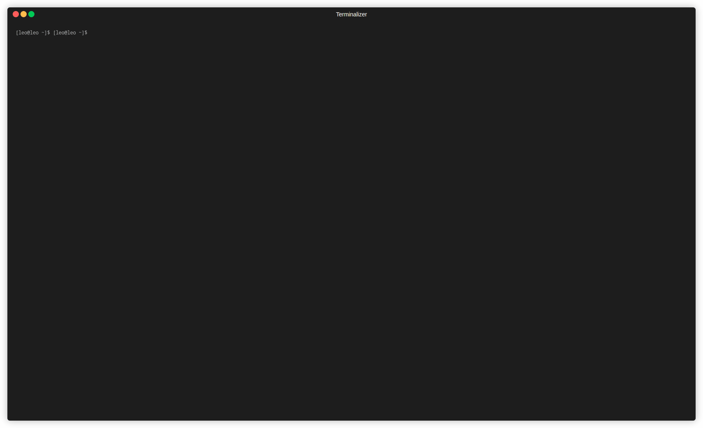

# homodoro
A very simple terminal application to use the pomodoro technique and keep track of daily tasks.

  

## Contents
- [About the project](#about-the-project)
- [Installation](#installation)
- [Usage](#usage)
  - [Commands](#commands)
  - [Tasks file](#tasks-file)
  - [Timers and their alerts](#timers-and-their-alerts)
- [Todo](#todo)
- [Misc](#misc)

## About the project
The motivation behind this project was to simply get more used to the Haskell syntax and the Functional Programming way of programming, this was started with literally zero previous knowledge about Haskell and FP, I literally discovered stuff while I was doing it so it may be the case that the code is not the best possible but it definitely helped me get my feet wet in the entire Haskell and FP way of thinking.

If you are also new and interested in learning more about Haskell and FP, this might be a good project for you to take a look and probably try implementing some new features or refactoring code that looks bad, either way feel free to use, edit and do whatever you want with this piece of software.

Even though the program has very little functionality and is very simple, I do want to implement some more functionality to it as time goes by, if you are not interested in learning Haskell but want a specific feature to be implemented, feel free to create an issue.

## Installation
Currently only Linux is supported.

You can download the binary through the [Releases](https://github.com/c0nradLC/homodoro/releases). You can run it directly where it was downloaded or put it in a directory present in your `PATH`.

You can also build and install from source, you just need to clone this repo and build/install with [Stack](https://docs.haskellstack.org/en/stable/).

## Usage
Just run `homodoro` and you should see the timers and the task list.

The Pomodoro cycle consists of one Pomodoro round and one Short break, once the 4th Short break ends, instead of changing the focus back to the Pomodoro Round timer, it will change to the Long break timer, once the Long break is finished the Pomodoro cycles counter reset.
> You may choose to use homodoro this way or the way you want, but currently the Pomodoro cycles counter should be working as described above.

#### Commands
You can press `c` when not editing or creating a task to see the commands.

- `Shift + Tab` AKA `BackTab` Go to next timer
- `q` Quit application
- `s` Start/stop timer
- `r` Reset timer
- `i/d` Increase/Decrease timer by 1min
- `I/D` Increase/Decrease timer by 10sec
- `Insert` Add a task
- `e` Edit a task
- `Del` Delete a task
- `Ctrl + C` Change a task's status

Other than the commands that are shown at the bottom of the screen, you can check the [List](https://hackage.haskell.org/package/brick-2.3.1/docs/Brick-Widgets-List.html#g:3) and [Editor](https://hackage.haskell.org/package/brick-2.3.1/docs/Brick-Widgets-Edit.html) commands in the Brick documentation for each of the Widgets.

#### Tasks file
The tasks file is saved at the path set to the `XDG_DATA_HOME` environment variable.
> According to it's [specification](https://specifications.freedesktop.org/basedir-spec/basedir-spec-latest.html), if that variable is not set or empty, it defaults to $HOME/.local/share on non-Windows systems.

#### Timers and their alerts
When a timer reaches zero an alarm sound should ring and a notification popup should appear.
  
> The popup is shown using the [libnotify](https://hackage.haskell.org/package/libnotify) library
  
> Initially the alarm sound was played using OpenAL and ALUT (OpenAl Utility Toolkit) through the [haskell-openal/alut](https://github.com/haskell-openal/ALUT) package but I had some problems trying to compile the project in Windows so I switched it to [SDL2](https://hackage.haskell.org/package/sdl2) and [SDL2-mixer](https://hackage.haskell.org/package/sdl2-mixer) to see if it helped.

>  I'm still having issues compiling it on Windows despite having found some possible [solutions](https://github.com/haskell-game/sdl2/issues/277#issuecomment-1339145721) to it. If you'd like to have this also running on Windows feel free to try and make it work and share the steps if possible. I might come back to this from time to time to try and make it work, but I'm not commited to it.

## Todo
This list is not ordered by importance or preference.

- [x] Add Nix support
- [ ] Improve Nix integration
- [ ] Persist set timer values
- [ ] Allow to set a priority for each task
- [ ] Allow to sort/move tasks in the list
- [ ] Implement task archiving
- [ ] GH Actions in the repo
- [ ] Import/Export tasks to/from other formats

## Misc
Written in Haskell using the [brick](https://github.com/jtdaugherty/brick) library. This was heavily inspired by the other brick programs featured in it's repo's [Featured Projects](https://github.com/jtdaugherty/brick#Featured-Projects).
