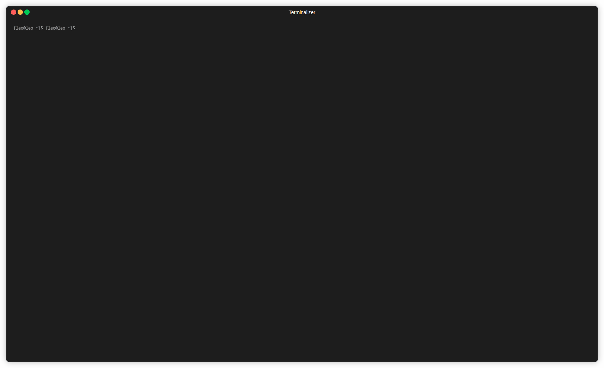
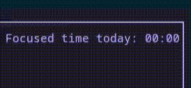

# homodoro
<p align="center">
  
</p>
homodoro is a simple TUI program to use the pomodoro technique and keep track of daily tasks with pop-up and audio notifications.

## Installation
Currently only Linux is supported.

### Nix
```$ nix-env -if https://github.com/c0nradLC/homodoro/tarball/main```

### AUR
```$ yay -S homodoro-bin ```

```$ paru -S homodoro-bin ```

### Any linux distro
Download the binary through the [Releases](https://github.com/c0nradLC/homodoro/releases). You can run it directly where it was downloaded or put it in a directory present in your `PATH`.

You can also build homodoro with `nix-build` or `cabal build` or run a development shell with `nix-shell` and `cabal run`.

## Usage
Just run `homodoro` and you should see the timers and the task list.

Every time the Pomodoro timer reaches 0, the `Pomodoros` counter increases by 1, every 4th `Pomodoro` round ends, instead of switching the focus to `Short Break`, the focus will be switched to `Long Break`, everytime a `Long Break` is finished, the (hidden)counter that switches to `Long Break` on the 4th `Pomodoro` resets and the cycle starts again.

Other than the commands that are shown at the bottom of the terminal, you can check the [List](https://hackage.haskell.org/package/brick-2.3.1/docs/Brick-Widgets-List.html#g:3), [Editor](https://hackage.haskell.org/package/brick-2.3.1/docs/Brick-Widgets-Edit.html) and [Dialog](https://hackage.haskell.org/package/brick-2.3.1/docs/Brick-Widgets-Dialog.html) commands in the Brick documentation for each of the Widgets default commands.

## Dependencies
homodoro depends on both `sdl2_mixer` and `libnotify` for the audios and pop-up notifications.

## Configuration
### Persistency file
homodoro persists daily data 
  - Application state of the timers
  - Amount of Pomodoro rounds
  - Total focused time in secods
  - Total break time in seconds

at `$XDG_DATA_HOME/homodoro/data/<current_date>_data.json`.

### Tasks file
The default tasks file path is at `$XDG_DATA_HOME/homodoro/tasks.md`, which would normally be at `~/.local/share/homodoro`. **You can set the tasks file path to whatever file(markdown or json) you want through the configuration screen.**

### Audio files directory
The default audio files path is at `$XDG_DATA_HOME/homodoro/audio`, which would normally be at `~/.local/share/homodoro/audio`.

There are three distinct sounds that are played in homodoro, the `Start/Stop`, `Timer tick` and `Timer (ended) alert` sounds, you can set the volume for each of these through the configuration screen, if the volume is at 0% then it won't be played.

There are default embedded audio files for each of the audio that gets played, but it is possible to overwrite them individually by placing audio files in the specified audio directory path shown and set through the configuration screen. 

homodoro looks for files named (case-insensitive) `TimerStartStop.*`, `TimerTick.*` and `TimerAlert.*` and uses them as the audio instead of the default embedded ones.

> The audios are played using [sdl2-mixer](https://hackage.haskell.org/package/sdl2-mixer)
  
### Notification pop-up


When enabled, a notification pop-up is shown when a timer ends.
> The popup is shown using the [libnotify](https://hackage.haskell.org/package/libnotify) library
  

## Misc
Written in Haskell using the [brick](https://github.com/jtdaugherty/brick) library. This was heavily inspired by the other brick programs featured in it's repo's [Featured Projects](https://github.com/jtdaugherty/brick#Featured-Projects).