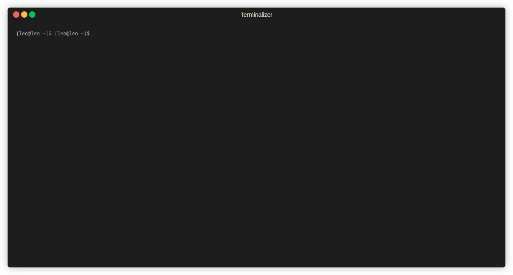

# homodoro
A very simple terminal application to use the pomodoro technique and keep track of daily tasks.

  

## Contents
- [About the project](#about-the-project)
- [Installation](#installation)
- [Usage](#usage)
- [Todo](#todo)
- [Misc](#misc)

## About the project
The motivation behind this project was to simply get more used to the Haskell syntax and the Functional Programming way of programming, this was started with literally zero previous knowledge about Haskell and FP, I literally discovered stuff while I was doing it so it may be the case that the code is not the best possible but it definitely helped me get my feet wet in the entire Haskell and FP world, I might even say that there were moments where programming/learning this felt like magic.

If you are also new and interested in learning more about Haskell and FP, this might be a good project for you to take a look and probably try implementing some new features or refactoring code that looks bad, either way feel free to use, edit and do whatever you want with this piece of software.

Even though the program has very little functionality and is very simple, I do want to implement some more functionality to it as time goes by, if you are not interested in learning Haskell but want a specific feature to be implemented, feel free to create a issue.

## Installation
Currently only Linux is supported.

You can download the binary through the [Releases](https://github.com/c0nradLC/homodoro/releases). You can run it directly where it was downloaded or put it in a directory present in your `PATH`.

## Usage
Just run `homodoro` and you should see the timer and the task list.

Other than the commands that are shown in the screen, you can check the [List](https://hackage.haskell.org/package/brick-2.3.1/docs/Brick-Widgets-List.html#g:3) and [Editor](https://hackage.haskell.org/package/brick-2.3.1/docs/Brick-Widgets-Edit.html) commands in the Brick documentation for each of the Widgets.

The tasks file is saved at the `XDG_DATA_HOME` environment variable.

When the timer reaches zero an alarm sound should ring and a notification popup should appear.

The popup is shown using the [gi-notify](https://hackage.haskell.org/package/gi-notify) library, autogenerated by [haskell-gi](https://github.com/haskell-gi/haskell-gi)

The alarm sound is played using OpenAL and ALUT (OpenAl Utility Toolkit) through the [haskell-openal/alut](https://github.com/haskell-openal/ALUT) package.

## Todo
- [ ] Add Nix support
- [ ] Import/Export tasks to other formats (Markdown being the first and only that comes to mind)
- [ ] Implement a settings screen/dialog to allow selection of where the tasks file will be stored, which sound file to use for the alarm and other configurations
- [ ] Allow to set a priority for each task
- [ ] Add sort options to the task list

## Misc
Written in Haskell using the [brick](https://github.com/jtdaugherty/brick) library. This was heavily inspired by the other brick programs featured in it's repo's [Featured Projects](https://github.com/jtdaugherty/brick#Featured-Projects).
